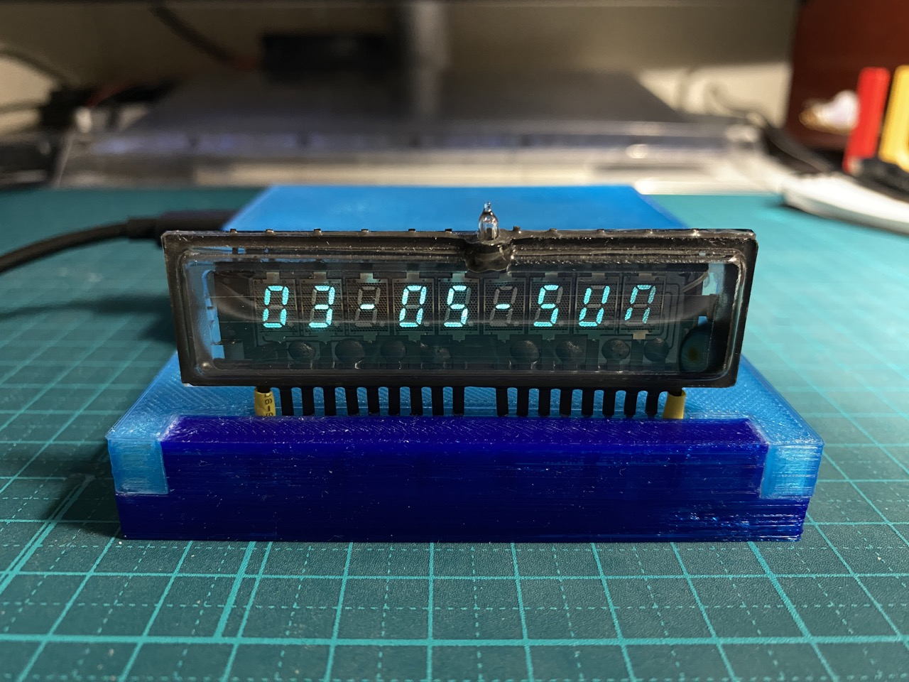
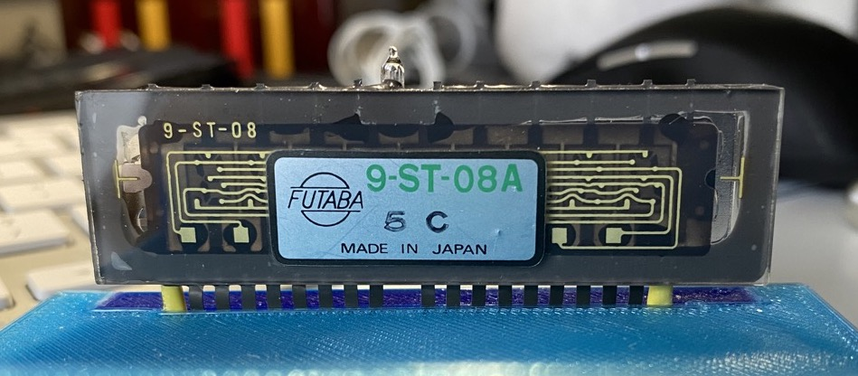
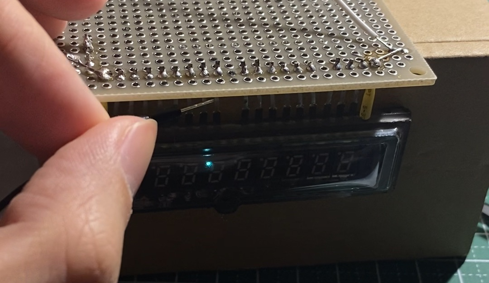
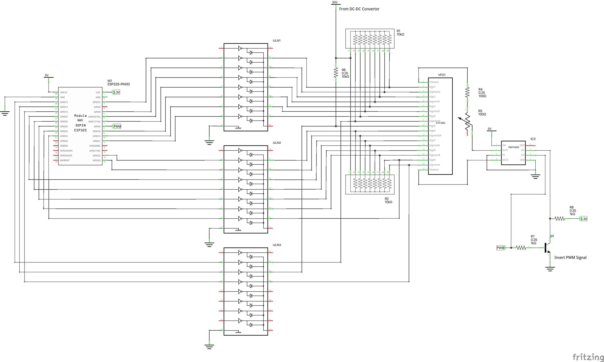
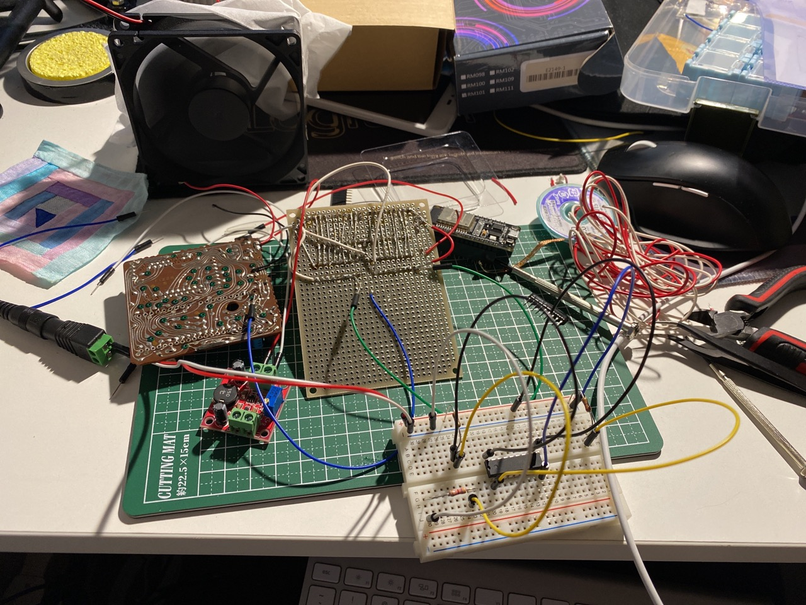
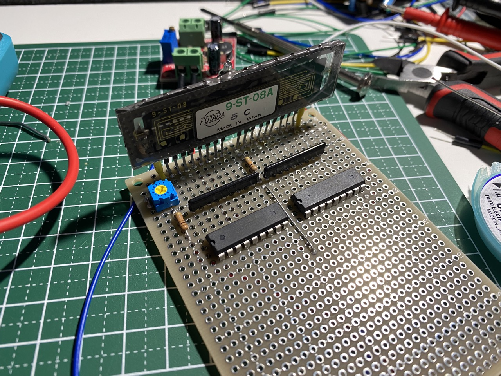
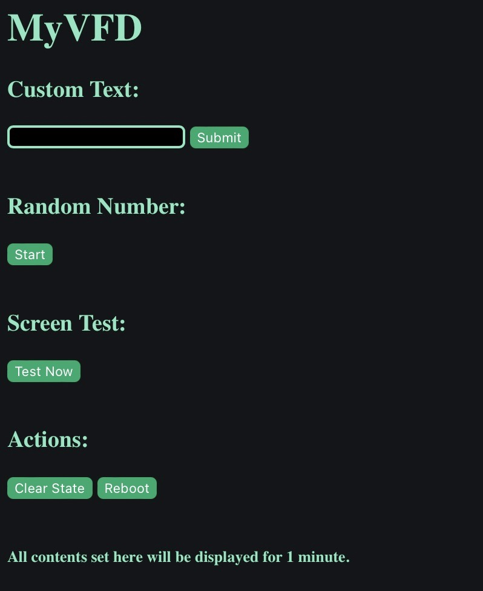
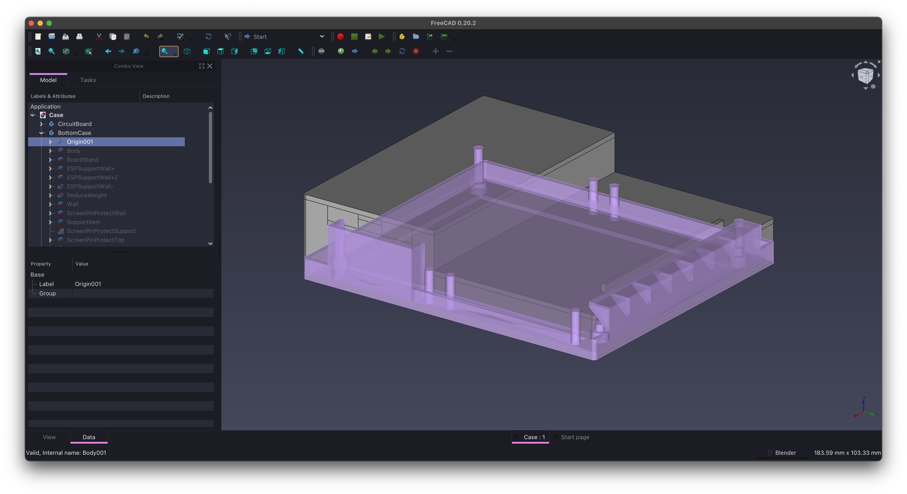

# MyVFD - A 9-Digit VFD Info Station

Last year, I got an old Sharp EL-8109 calculator. Which uses a 9-digit Futaba 9-ST-08A VFD display. The calculator still works, but the shell is in bad shape, making it worth almost nothing. So I decided to use the screen inside to make something useful and look good.

This is the first hardware project I've ever made, so maybe I will do something wrong. Since I'm not a native English speaker, if you found any strange grammar, it's possibly my fault.

## What is a VFD

VFD means vacuum fluorescent display. Widely used in DVDs, radios, cassette decks, and so on. VFD screens look bright and visible from all angles. Making them the best choice for these devices. Today you can still see VFD screens in POS machines.

But LCD screens are becoming a better choice these days, and VFDs are no longer popular. Today, the green color of VFD screens gives them a retro vibe. If you want to see more beautiful VFDs, I recommend you watch this YouTube video by Posy: [VFD Displays](https://www.youtube.com/watch?v=PkPSDOjhxwM).

The screen 9-ST-08A was used in a variety of calculators around the 1970s, like Sanyo CX-8032 or Unisonic 1040. The company [Futaba (双葉電子工業株式会社)](https://www.futaba.co.jp/product/vfd) was Founded in 1948, making vacuum tubes and related things. They produced VFD screens until the end of 2021. Now they are moving on to newer display technologies.

## How to use the screen

This screen is too old, so it's almost impossible to find the datasheet. But most VFD screens are using the same structure. We can find out the pinout by ourselves.

This image from Futaba's website shows the basic structure of a VFD screen.

VFD screens are very similar to vacuum tubes. Mainly, we have filaments, grids, and anodes. Filaments are very thin wires. They provide heat and a negative charge to the system. Anodes and grids provide high-voltage positive change. Electrons will fly from filaments, pass the grids, and hit the anodes when they are both powered. Then you can see the beautiful green light from the phosphor.

On a VFD screen. The pins on both sides are typically filament pins. They require a voltage of around 3V. And because we need a negative charge on the filament, the side near the positive pin will look dim. So it's best to power it with AC. This can ensure the screen lights evenly and extend its life. Since I want to have a relatively small package on the final product. This time I will just use DC to power the screen.

When you add voltage to the pin, you should keep eye on the filament wires. If they start to glow, turn down the voltage immediately. Otherwise, the wires can start to melt and break.

After wiring the filament properly, we can start to take a look at other pins. Anodes and grids require a relatively high voltage. To provide this voltage, you need a step-up DC/DC converter. Connect the converter to the same ground as the filament, and use the high voltage to probe the pins. You need to connect both an anode pin and a grid pin to turn one segment on. Since I have a small screen that doesn't require such a high voltage to just light, I can use 5V for probing.

By probing you will know which pin is connected to which part of the screen. You can also check if there is a schematic printed behind the screen, like the image above.

## Build the circuit

In this circuit, I'm using Darlington Transistor Arrays (ULN2803) to control the screen. When the input pin of a transistor is low, the current goes through a 10K pull-up resistor and then the screen. When the input pin is high, it goes through the resistor and the transistor to the ground.

I have referenced [this](https://www.instructables.com/A-Simple-Driver-for-VFD-Displays/) design beforehand. In the schematic, it says the common pin of the ULN2803 should connect to the ground. But after reading the datasheet and testing, I found this pin should not connect to anything. And the GND pin should be grounded.

I also found that the first transistor in the ULN2803 has a different behavior than others. When the input pin 1 is high, all the other transistors in the array will be turned on too. I don't understand why, but I can simply ignore the first pin. Tell me why if you know the reason.

On the ESP32 side. I'm using almost all the GPIO pins. but specifically left G2 behind. Because G2 is also connected to the onboard LED.

(The big red wire is for testing before using any high voltage.)

And after the DC/DC converter soldered, I wrote a small program to test if there are any bad soldering. 

## Programming the ESP32

To control the screen. I'm using a library called [SevSeg](https://github.com/DeanIsMe/SevSeg). It was made to control 7-Seg LED displays but also works on VFD. Because my screen has 9 digits, I need to modify the code to use more than 8 digits. And this library does not support some of the alphabets, so I added the missing parts by myself.

After a week of programming. My VFD info station now supports:

- Date / Time (Sync with NTP server at the start.)
- Current Temperature / Max Temperature / Min Temperature (From OpenWeather.)
- Custom Text (Set from the web UI.)
- Random Number Generator (Set from the web UI.)

And my code is structured so you can add new features to the code easily.

Because ESP32 has 2 cores, I created separate FreeRTOS tasks for them. I specifically use core 1 for refreshing the screen, and core 0 for other things. So network traffic won't interrupt screen refreshing.

To use my code, you need to create a "secret.h" file from the template. Then input your wifi SSID, password, OpenWeather API key, and location info.

If everything is set correctly, you will see the IP address on the screen after it is connected. The screen will change between date/time and weather info. You can access the IP address to control it from the web UI. 

## Make a shell

Finally, to cover my bad soldering, I need a shell for the board. This time I'm using FreeCAD. After tons of prototypes on my 3D printer, I got a reasonably good final result.

After a month of hard work, I finally finished my first hardware project. I uploaded a [demo](https://www.youtube.com/watch?v=nbPkMLYwmgs) on YouTube, you can check it out. Hope you like it. Follow me on social media for my other projects. 

[Twitter (EN)](https://twitter.com/Megabits_Studio), [Twitter (CN)](https://twitter.com/Megabits_mzq), [Twitter (JP)](https://twitter.com/Megabits_mzq_jp), [Mastodon](https://fedibird.com/web/accounts/108675431540717996/)

See you next time.
